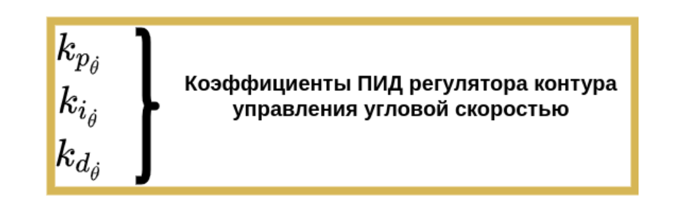
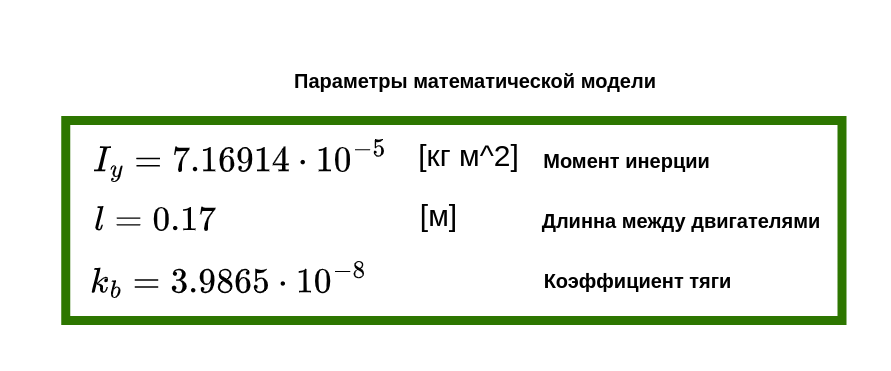

# Инструкция для создания простого симулятора БЛА в канале тангажа

В этой практической работе вы создадите систему для моделирования БЛА. На её примере поймёте, как функционируют симуляторы и системы управления. Рассмотрите систему стабилизации углового положения мультироторного БЛА.

    <strong>Источник: </strong> Михаил Колодочка

Основная задача симулятора — создать математическую модель БЛА, которая будет представлять собой пару двигателей, расположенных на краях базы с длиной L. Нужно заставить аппарат отклониться на заданный угол по часовой стрелке или против неё. Для этого необходима система управления, которая изменит угловую скорость двигателей. Вы представите, как выглядит аппарат, разберётесь в модели динамики и системе управления. 

Вот пример того, как могло выглядеть это задание при его выполнении на
реальном оборудовании:

    <strong> Источник</strong> https://youtu.be/2zwsyEltwdA?si=G2LdyAASsfH9Ki92

Ознакомьтесь с важными для работы обозначениями:

$\ddot{\theta}_{cmd}$ - требуемое угловое ускорение.

$\dot{\theta}_{cmd}$ - требуемая угловая скорость.

$\dot{\theta}_{cmd}$ - требуемое угловое положение.

$T_{cmd}$ - требуемый уровень тяги.

$\omega_1, \omega_2$ - угловая скорость первого и второго двигателей.

$M_y$ - момент силы создаваемый разностью тяг двигателей.

$\ddot{\theta}$ - угловое ускорение.

$\dot{\theta}$ - угловая скорость.

${\theta}$ - угловое положения.

$k_b$ - коэффициент тяги двигателей.

$l$ - расстояние между двигателями.

$I_y$ - момент инерции.

## Модель динамики БЛА.

    <strong>Здесь и далее источник: </strong> Михаил Колодочка

Чтобы рассчитать угловое ускорение $\ddot{\theta}$ (рад / сек^2), необходимо разделить момент вдоль рассматриваемой оси $M_y$ (Н/м) на момент инерции $I_y$ (кг/м^2). 

В этой модели момент зависит от угловых скоростей двигателей $\omega_1, \omega_2$ (рад/сек), коэффициента тяги $k_b$ и длины базы (лучей) $l$ , на которых установлены двигатели. В базе есть силы, которые создаются двигателем и плечом (м). Момент равен произведению силы на плечо. Для появления крутящего момента , угловые скорости двигателей должны быть равными  положительному и отрицательному значению команды $\ddot{\theta}_{cmd}$ (рад / сек^2) от системы управления в сумме с командой по тяге $T_{cmd}$ . 

Математическая модель описывает динамику ЛА — силы и моменты, которые действуют на систему. Из неё можно получить угловые и линейные ускорения. Мы получили приращения движения, теперь определим угловую скорость и угловое положение.

Чтобы найти угловую скорость, проинтегрируем угловое ускорение по времени. Запишем выражение в дискретной форме в виде суммы приращений (угловых ускорений), умноженных на шаг системы $dt$ (сек). Аналогично определим угловое положение. Его аргументом под интегралом будет рассчитанная ранее угловая скорость.

## Cистема управления БЛА

Рассмотрим систему управления для упрощенной модели аппарата.
Она состоит из **двух** контуров управления. Нумерация контуров с права на лево.

**Первый контур** отвечает за стабилизацию угловой скорости $\dot{\theta}$ (рад/сек) летательного аппарата по целевой команде $\dot{\theta}_{cmd}$ (то есть стремится уменьшить рассогласование между заданной и истиной угловой скоростью). К примеру, такие команды оператор задаёт аппарату в акробатическом (acro) режиме управления полётом в гонках на мультикоптерах. 

**Второй контур** управления отвечает 
за стабилизацию аппарата по угловому положению $\theta$ (рассмотрим его как угол тангажа, размерность будем считать в радианах) относительно заданного целевого положения $\theta_{cmd}$. Заданный угол поддерживается в режиме стабилизации по угловому положению (чаще всего встречаются обозначения ANGLE или STABILIZE).

На вход модели динамики приходит команда $\ddot{\theta}_{cmd}$. Рассчитав угловое ускорение системы на основе команды, проведём интегрирование и получим угловую скорость $\dot{\theta}$ и угловое
положение ${\theta}$

Угловое положение используют, чтобы рассчитать ошибку в контуре стабилизации по угловому положению. При помощи ПИД-контроллера на выходе получим желаемую угловую скорость $\dot{\theta}_{cmd}$. 

Угловую скорость $\dot{\theta}$ и целевую угловую скорость $\dot{\theta}_{cmd}$ используют, чтобы рассчитать ошибку в контуре управления угловой скоростью. На выходе контура получаем $\ddot{\theta}_{cmd}$ команду по угловому ускорению, которая используется в модели динамики.

Если представить реальный аппарат, то команды на выходе модели отправятся на каждый из двух регуляторов оборотов в виде сигнала (например, ШИМ), таким образом будет регулироваться тяга создаваемая аппаратом. Подробно разберём формирование команд в модуле 4. 

Рассмотрим параметры времени моделирования:

В любой системе моделирования есть начальное время моделирования, время с момента начала расчётов и шаг моделирования, то есть условное время в симуляторе за одну итерацию моделирования. Текущее время моделирования с каждым шагом увеличивается на dt и характеризует количество итераций при моделировании. За конечное время моделирования принимают момент, когда моделирование завершено.

Алгоритм для моделирования системы:

Поэтапно рассмотрим каждый из пунктов:

1. Зададим начальные условия системы: начальное угловое положение
и начальную угловую скорость: $${\theta = \theta_0}$$, $${\dot{\theta} = \dot{\theta}_0}$$
 Зададим параметры константы: момент инерции ${I_y}$, коэфициент тяги двигателя $k_b$  и длину базы $l$. Зададим целевое угловое положение ${\theta_{cmd}}$ — угол, к которому система должна стремиться при движении). В системе моделирования шаг времени будем считать константой $dt$. Так как в данной задаче рассматривается только управление угловым положением, а линейное движение ЛА не рассматривается команду по тяге ${T_{cmd}}$ будем считать константой.
 Зададим начальные условия для текущего ${t_0}$ и конечного времени моделирования ${T}$ (сек).

2. Начнём моделирование и рассчитаем ошибку по угловому положению:

$${e_{\theta_{k}} = \theta_{cmd} - \theta}$$

3. Рассчитаем целевую угловую скорость аппарата на основе ошибки:

$${\dot{\theta}_{cmd} = k_{p_{\theta}}  e_{\theta_{k}} + k_{i_{\theta}}\sum_{k=0}^{n} e_{\theta_{k}}dt + k_{d_{\theta}} \frac{e_{\theta_{k}} -e_{\theta_{k-1}} }{dt}}$$ 

Для коэффициентов ПИД-регулятора используем обозначения:

Ограничим выходную команду:

$${\dot{\theta}_{cmd} = 
\begin{cases} 
\text{max\_value} & \text{if } \dot{\theta}_{cmd} > \text{max\_value} \\
\text{min\_value} & \text{if } \dot{\theta}_{cmd} < \text{min\_value} \\
\dot{\theta}_{cmd} & \text{otherwise}
\end{cases}}$$

Предлагается рассмотреть максимальную целевую скорость в диапазоне
от 50 до 300 градусов в секунду.

4. Рассчитаем ошибку по угловой скорости системы:

$$e_{\dot{\theta_{k}}} = \dot{\theta}_{cmd} - \dot{\theta}$$

5. Аналогично третьему пункту рассчитаем желаемое угловое ускорение для системы:

 $${\ddot{\theta}_{cmd} = k_{p_{\dot{\theta}}}  e_{\dot{\theta}_{k}} + k_{i_{\dot{\theta}}}\sum_{k=0}^{n} e_{\dot{\theta}_{k}}dt + k_{d_{\dot{\theta}}} \frac{e_{\dot{\theta}_{k}} -e_{\dot{\theta}_{k-1}} }{dt}}$$
  
Для коэффициентов ПИД-регулятора используем обозначения: 

Ограничим выходную команду:

$$\ddot{\theta}_{cmd} = 
\begin{cases} 
\text{max\_value} & \text{if } \ddot{\theta}_{cmd} > \text{max\_value} \\
\text{min\_value} & \text{if } \ddot{\theta}_{cmd} < \text{min\_value} \\
\ddot{\theta}_{cmd} & \text{otherwise}
\end{cases}$$

Предлагается рассмотреть максимальное целевое угловое ускорение в диапазоне от 5-15 радиан на секунду в квадрате.

6. Подставим команду $\ddot{\theta}_{cmd}$  и константы $I_y$, $k_b$, $l$, $T_{cmd}$ в модель динамики:

 Учитывайте что угловая скорость не может быть отрицательной. Установите 0 значение даже если значение \omega получилось меньше нуля. Данная модель не может рассматривать двигатели с изменяемым направлением вращения. 

7. Численно проинтегрируем угловое ускорение $\ddot{\theta}$. Получим $\dot{\theta}$ и $\theta:$

$$\dot{\theta} = \sum_{k=0}^{N} \ddot{\theta} dt$$
$$\theta = \sum_{k=0}^{N} \dot{\theta} dt $$

Итерация моделирования закончена. 

Прибавляем к текущему времени моделирования  шаг $t = t + dt$  и **возвращаемся ко второму пункту.** Продолжаем до тех пор, пока время $t$ не сравняется с конечным временем моделирования $T$.

Выполняя практическую работу запрограммируйте описанный выше алгоритм и настройте ПИД-регуляторы в системе управления. По результатам работы постройте графические зависимости эволюции угла тангажа, его угловой скорости и углового ускорения  от времени.

При создании симулятора рекомендуем использовать параметры:

Величина параметра  в данной задаче будет константой в виде любого положительного числа (например = 10).

При создании системы управления коэффициенты регуляторов необходимо подобрать самостоятельно.

Рассмотрите пример из описания и занятия, чтобы разобраться со сложностями. Вопросы по работе можно задать в чате.
